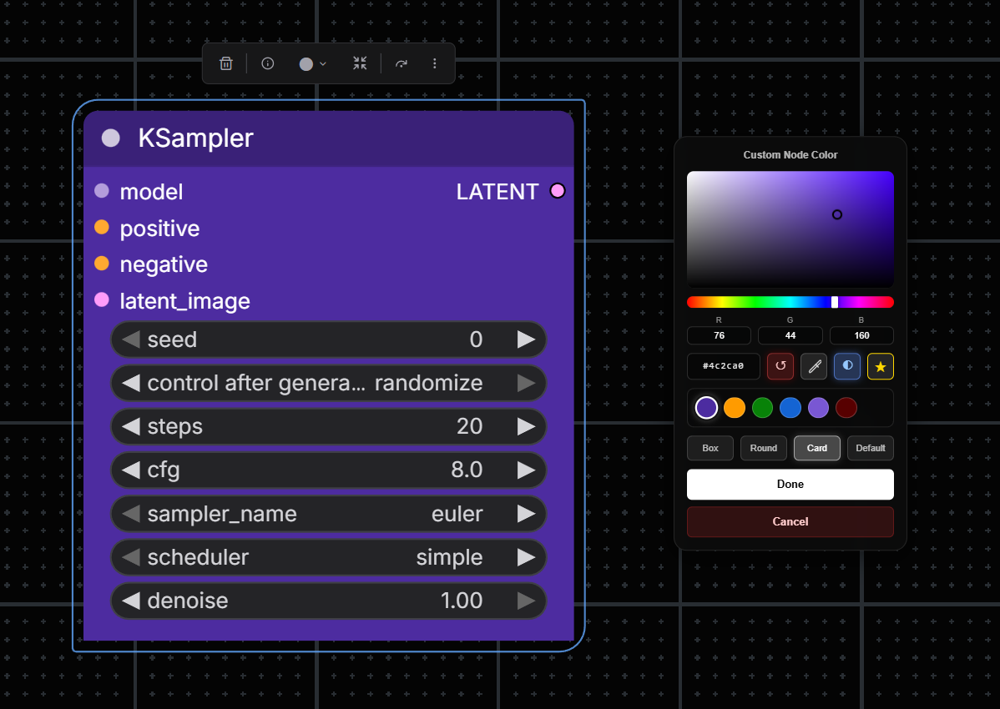

# ComfyUI Custom Node Color 🎨

> **A modern, GUI-based color picker and utility suite for ComfyUI.** > Change node colors with style, pick colors from your screen, and handle HEX data efficiently.

> [!IMPORTANT]
> NODES 2.0 ARE NOT TESTED FOR COMPATIBILITY



## ✨ Key Features

- **Glassmorphism UI**: A modern interface with blur effects and smooth animations.
- **Eyedropper Tool 🖊️**: Pick any color from your screen (works outside the browser window on Chrome/Edge/Opera).
- **Favorites System ⭐**: Save up to 7 colors with a smart FIFO queue and overwrite warnings.
- **Batch Coloring**: Apply color to multiple selected nodes instantly.
- **Smart UX**: Auto-save on click-away and quick reset options.

---

## 🛠️ Context Menu Tool
*Accessed via Right-Click on any node.*

This tool allows you to visually change the background color of any node in your workflow.

### 🎮 Controls
| Control | Icon | Action |
| :--- | :---: | :--- |
| **Pick Color** | 🎨 | Use the Saturation/Value square + Hue slider. |
| **Eyedropper** | 🖊️ | Pick a pixel color from anywhere on your screen. |
| **Favorite** | ☆ / ★ | Save current color / Remove from favorites. |
| **Reset** | ↺ | Revert to the node's original default color. |

> **Note:** To use Batch Coloring, select multiple nodes, right-click one of them, and select "Custom Node Color". The chosen color will apply to **all** selected nodes.

---

## 📦 Node Library

Includes specialized nodes for handling color data within your workflows.


### 1️⃣ Hex Color Input
An interactive node designed for easy color selection and HEX string generation.

* **Output:** `HEX` (String, e.g., `#FF5733`)

**Highlights:**
* 🖱️ **Interactive**: Click the field to edit via text prompt.
* 🎨 **Visual**: Real-time color preview square.
* ✨ **Integrated**: "Pick Color" button opens the glassmorphism picker.

### 2️⃣ Convert HEX To RGB
A utility node that parses HEX strings into usable RGB integer channels.

**Inputs & Outputs:**

| I/O | Name | Type | Description |
| :--- | :--- | :--- | :--- |
| **Input** | `hex_color` | STRING | Hex string (e.g., `#FF5733` or `FF5733`). |
| **Output** | `R` | INT | Red channel (0-255). |
| **Output** | `G` | INT | Green channel (0-255). |
| **Output** | `B` | INT | Blue channel (0-255). |
| **Output** | `RGB` | STRING | Formatted string (e.g., `"255, 87, 51"`). |

**Robustness:**
* ✅ Auto-validates and cleans input.
* 🛡️ Handles invalid HEX gracefully (defaults to black).

---

## 📥 Installation

### Method 1: ComfyUI Manager (Recommended)
1.  Open **ComfyUI Manager**.
2.  Search for `Custom Node Color`.
3.  Click **Install**.
4.  Restart ComfyUI.

### Method 2: Manual Git Clone
1.  Navigate to your custom nodes folder:
    ```bash
    cd ComfyUI/custom_nodes/
    ```
2.  Clone the repository:
    ```bash
    git clone https://github.com/lovelybbq/comfyui-custom-node-color.git
    ```
3.  Restart ComfyUI.

## 🌐 Browser Support

| Browser | Eyedropper API | Note |
| :--- | :---: | :--- |
| **Chrome / Edge / Opera** | ✅ | Fully supported. |
| **Firefox** | ❌ | API not supported yet (button hidden). |

## 🤝 Contributing

Feedback is welcome! Feel free to open issues or submit pull requests if you have suggestions for improvements.

## 📄 License

MIT License.